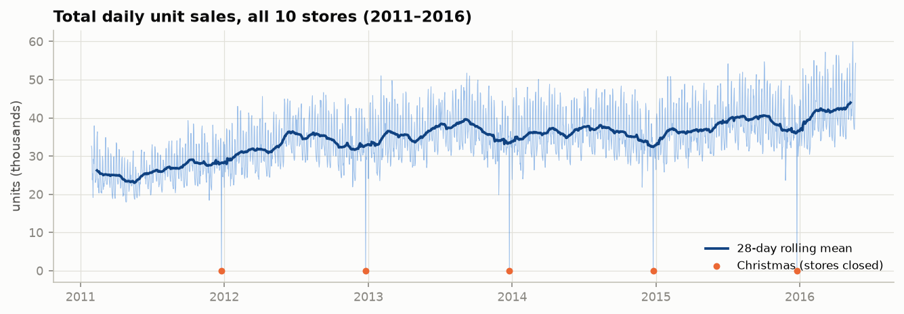
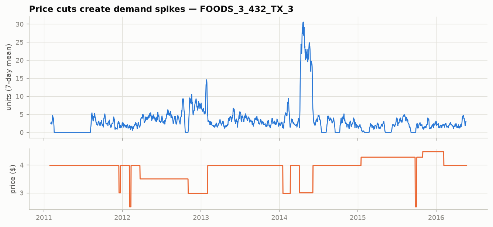
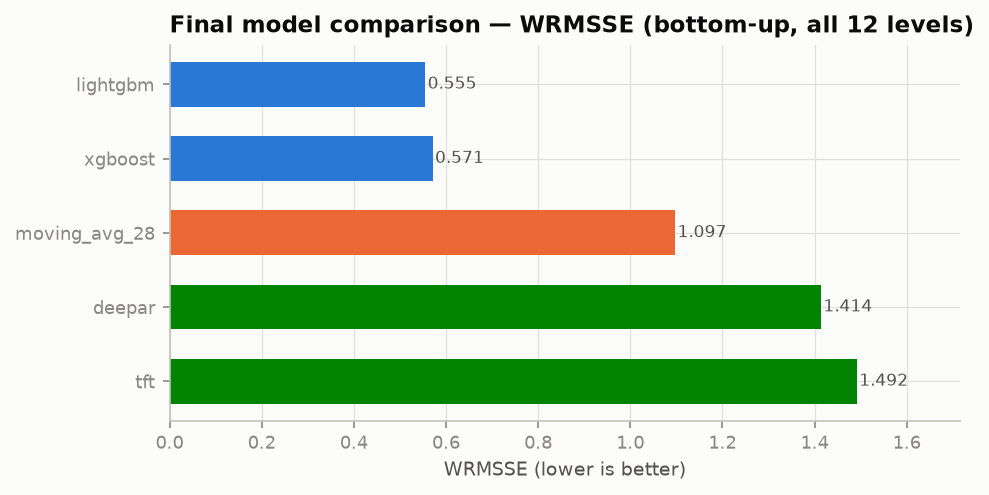

# Demand Forecasting Under Promotions and Events

Hierarchical time series forecasting at retail scale, built on the **M5 Forecasting Dataset** (Walmart): **30,490 SKU-store daily series over 1,941 days** (2011–2016).

## What this project does

- Builds a full hierarchical demand-forecasting pipeline on M5
- Compares **3 model families**: Gradient Boosting (LightGBM/XGBoost), **DeepAR-style** probabilistic RNNs, and **Temporal Transformers** (TFT-style) — with emphasis on promotion- and event-driven demand spikes
- Implements **hierarchical forecast reconciliation** producing coherent forecasts across the **12 M5 aggregation levels** (total → state → store → category → department → item → item-store)
- Evaluates with **WRMSSE** and **quantile (pinball) loss**, optimizing probabilistic forecasts for daily inventory decisions

## Status

🚧 In development — phase by phase. See [TODO.md](TODO.md) for the roadmap and [PROJECT_LOG.md](PROJECT_LOG.md) for the running log.

| Phase | Topic | Status |
|---|---|---|
| 1 | Understanding Demand Forecasting (theory) | ✅ [docs/phases/PHASE_01_demand_forecasting.md](docs/phases/PHASE_01_demand_forecasting.md) |
| 2 | Time Series Fundamentals | ✅ [docs/phases/PHASE_02_time_series_fundamentals.md](docs/phases/PHASE_02_time_series_fundamentals.md) |
| 3 | Literature Review | ✅ [docs/phases/PHASE_03_literature_review.md](docs/phases/PHASE_03_literature_review.md) |
| 4 | Project Planning & Architecture | ✅ [docs/phases/PHASE_04_project_planning.md](docs/phases/PHASE_04_project_planning.md) |
| 5 | M5 Dataset & Preprocessing | ✅ [docs/phases/PHASE_05_dataset.md](docs/phases/PHASE_05_dataset.md) |
| 6 | EDA | ✅ [docs/phases/PHASE_06_eda.md](docs/phases/PHASE_06_eda.md) |
| 7 | Feature Engineering | ✅ [docs/phases/PHASE_07_feature_engineering.md](docs/phases/PHASE_07_feature_engineering.md) |
| 8 | Baselines | ✅ [docs/phases/PHASE_08_baselines.md](docs/phases/PHASE_08_baselines.md) |
| 9 | Gradient Boosting | ✅ [docs/phases/PHASE_09_gradient_boosting.md](docs/phases/PHASE_09_gradient_boosting.md) |
| 10 | DeepAR-style Model | ✅ [docs/phases/PHASE_10_deepar.md](docs/phases/PHASE_10_deepar.md) |
| 11 | Temporal Transformer | ✅ [docs/phases/PHASE_11_temporal_transformer.md](docs/phases/PHASE_11_temporal_transformer.md) |
| 12 | Hierarchical Reconciliation | ✅ [docs/phases/PHASE_12_reconciliation.md](docs/phases/PHASE_12_reconciliation.md) |
| 13 | Evaluation (WRMSSE, Quantile Loss) | ✅ [docs/phases/PHASE_13_evaluation.md](docs/phases/PHASE_13_evaluation.md) |
| 14 | Promotions & Events Analysis | ✅ [docs/phases/PHASE_14_promotions_events.md](docs/phases/PHASE_14_promotions_events.md) |
| 15 | Error Analysis | ✅ [docs/phases/PHASE_15_error_analysis.md](docs/phases/PHASE_15_error_analysis.md) |
| 16 | Research Analysis | ⏳ |
| 17–18 | Engineering Standards & Documentation | continuous |

## A taste of the data

Five years of Walmart daily unit sales — trend, violent weekly seasonality, and stores literally closing on Christmas:



And the project's namesake phenomenon — inferred promotions (price < 85% of an item's median) driving up to 10× demand spikes:



More in the [EDA report](docs/phases/PHASE_06_eda.md): +37% weekend lift, per-state SNAP effects, the 73%-zeros median series, and why every one of these findings changed the modeling plan.

## Headline result

On the official **WRMSSE** metric (scaled, dollar-weighted, all 12 levels), gradient boosting wins — reproducing the real M5 outcome:



The twist: on **WAPE** the ranking *reverses* and the deep models win. Same forecasts, opposite verdicts — because the metric encodes the business objective, and the point statistic you report (mean vs median) must match it. Switching DeepAR's point forecast from median to mean cut its WRMSSE 2.8× (1.88 → 0.68). The full story is in the [evaluation report](docs/phases/PHASE_13_evaluation.md).

## Repository layout

```
configs/           # Hydra config tree — the experiment surface
data/              # raw/interim/processed M5 data (gitignored)
docs/phases/       # per-phase teaching + design documents
notebooks/         # EDA (imports from src, never defines logic)
outputs/           # forecasts, checkpoints, mlruns (gitignored)
reports/figures/   # final plots & tables
scripts/           # thin CLI entry points, one per pipeline stage
src/m5forecast/    # the package: data → features → models → hierarchy → evaluation → analysis
tests/             # pytest (leakage tests, metric correctness, smoke tests)
```

Architecture, module rationale, and dependency graph: [Phase 4 doc](docs/phases/PHASE_04_project_planning.md).

## Setup

```bash
python -m venv .venv
.venv\Scripts\activate        # Windows
pip install -r requirements.txt
pip install -e .              # install m5forecast in editable mode

# data (one-time Kaggle API setup — see scripts/download_data.py docstring)
python scripts/download_data.py
python scripts/build_panel.py # raw CSVs -> data/interim/panel.parquet

pytest                        # run the test suite
```
