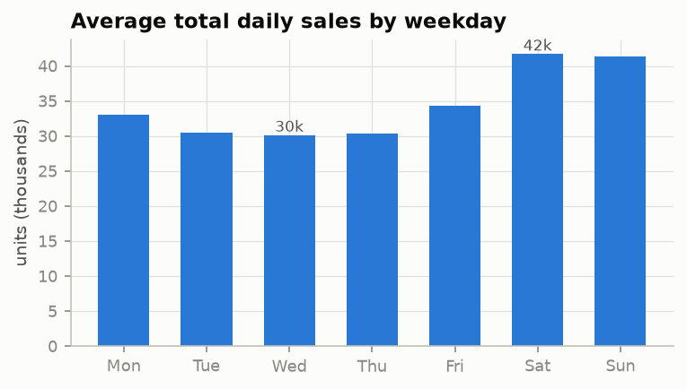
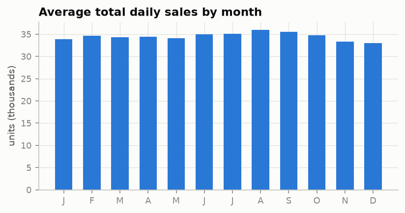
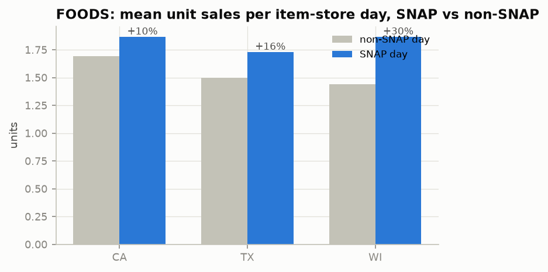
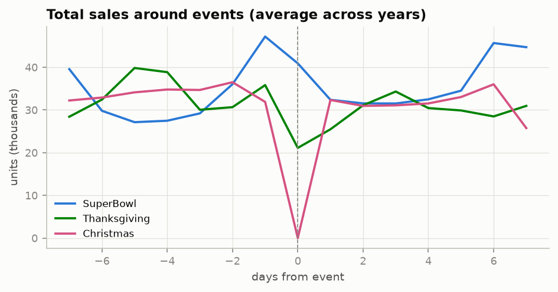
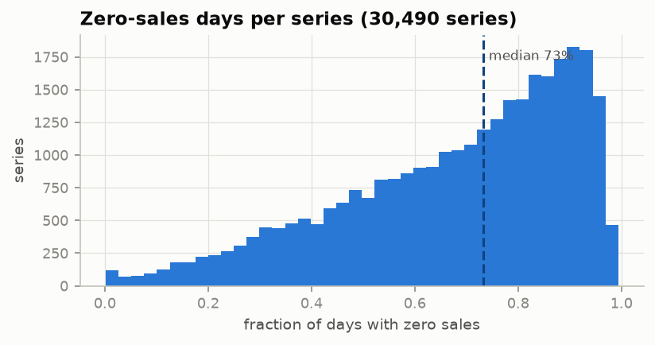
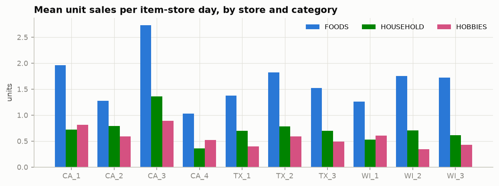

# Phase 6 — Exploratory Data Analysis

> Status: ✅ Complete · Every claim from Phases 1–5 is now a measurement. Figures regenerate via `python scripts/run_eda.py`; headline numbers land in `reports/figures/eda_stats.json`.

---

## 1. The aggregate picture

**Observations**
- Clear upward **trend**: ~25k units/day (2011) → ~45k (2016), roughly +60% over five years.
- The light-blue band around the rolling mean is **weekly seasonality** — the within-week swing is so strong it reads as texture at this zoom.
- **Christmas is a literal zero** (orange dots): stores closed. Measured: Christmas sales = **0.05% of an average day**. This is the outlier every M5 pipeline must treat deliberately — we exclude it from scale denominators later (Phase 13) and flag it as a feature, never silently drop it.
- Growth is not smooth — plateaus (2014) and accelerations (late 2015) mean a *global trend feature* would misfit individual periods; tree models will lean on recent-level features instead.

## 2. Weekly beats monthly — by a lot

- **Weekend lift is the dominant calendar signal**: Sat ≈ 42k vs Wed/Thu ≈ 30k — measured **+36.9%** weekend vs midweek. `day_of_week` will be one of the most important features in every model (verified via feature importance in Phase 9).
- **Monthly variation is tiny by comparison** (33–36k band, ~8% peak-to-trough; slight August peak, Nov–Dec trough). At the *total* level, yearly seasonality is weak — most "seasonality" budget in retail groceries is weekly. Individual items (ice cream, soup) still carry yearly patterns; they average out in the aggregate. Good interview nuance: *seasonality strength depends on aggregation level.*

## 3. SNAP is real, and it differs by state

FOODS-category unit sales per item-store day are higher on SNAP-disbursement days in every state — **+10% CA, +16% TX, +30% WI**. Wisconsin's schedule spreads benefits over the first half of the month and its stores show the strongest sensitivity. Two modeling consequences: the per-state `snap` flag (built in Phase 5) carries real signal, and *state × snap interactions* matter — global models must be able to express them (trees: via splits; deep models: via embeddings).

## 4. Events: two shapes of disruption

- **Christmas** (magenta): demand *builds* slightly, craters to zero on the day, rebounds above baseline after.
- **Thanksgiving** (green): pre-event peak two days before (shopping for the meal), ~40% dip on the day itself.
- **Super Bowl** (blue): the *day before* is the spike (snacks & drinks for the party), and the event lands on the weekly Sunday peak.

Different events have different *shapes* — which is why Phase 7 builds `days_to_event` / `days_from_event` features rather than a binary "is event day" flag: the flag can't see the build-up, which is where the money is.

## 5. Intermittency: the median series is 73% zeros

- Overall, **68.0% of all (series, day) cells are zero**; the **median series has 73.3% zero days**; the mode of the distribution sits at 85–95% zeros.
- This single histogram justifies half our modeling stack: Tweedie loss for LightGBM (mass at zero), Negative Binomial for DeepAR (over-dispersed counts), and deep skepticism toward MAPE (undefined at zero actuals — Phase 13).
- The left tail (series that almost always sell) are the high-volume staples that dominate revenue — and WRMSSE's dollar-weights (Phase 13) will make them dominate the score, too.

## 6. Stores are not interchangeable

- **FOODS leads everywhere** — highest velocity per item in every store.
- **CA_3 is a monster** (FOODS mean 2.7 units/item-day — 2.7× CA_4), **CA_4 the runt**. Same state, same assortment universe, wildly different volume: store identity is a first-class feature, and the M5 winner's *per-store pooled models* make sense in this light.
- Category mix varies by store (CA_1/CA_4/WI_1 relatively hobbies-heavy) — support for store×category pooling as an ensemble axis.

## 7. Promotions, finally visible

`FOODS_3_432` at store TX_3: baseline ~2–3 units/day at $4.00. Every dip to $3.00 (our inferred promotion: price < 85% of the item's median) produces an immediate demand spike — the extended spring-2014 promotion drove a sustained **~10× surge** (30 units/day). This is the phenomenon the whole project is named for, and it's exactly what history-only models cannot see coming (they can only chase it after it starts) while price-aware models can anticipate it. Phase 14 quantifies this contrast.

Selection note (a small research honesty story): the first heuristic — max price coefficient-of-variation — picked a $0.20 item whose "variance" was one early price artifact; the second picked an item whose story was stockouts, not promos. The shipped selector targets the phenomenon directly: flag promo days (price < 85% of median), require ≥30 such days, and maximize measured promo-day sales lift. *Define the phenomenon, then select on it.*

## 8. What EDA changes about our plan

| Finding | Consequence |
|---|---|
| 68% zeros, median series 73% | Tweedie / NegBin objectives confirmed; MAPE banned |
| Weekend +37%, monthly ±4% | day-of-week features prioritized; yearly seasonality handled per-item, not globally |
| SNAP +10/16/30% by state | keep per-state snap flag + allow state interactions |
| Events have shapes, not points | `days_to/from_event` features, not just flags |
| Christmas ≈ 0 | exclude day from scale denominators; explicit flag feature |
| Store heterogeneity (CA_3 vs CA_4) | store_id embeddings / per-store pooling worth testing |
| Price dips → up to 10× spikes | promo-inference features are the project's centerpiece |

## 9. Interview questions — Phase 6

1. *What's the strongest seasonality in retail grocery data and how do you know?* (Weekly — measured +37% weekend vs midweek at total level, dwarfing the ~8% monthly spread.)
2. *Why is MAPE a bad metric here?* (68% of actuals are zero — division by zero; and near-zero actuals make percentage errors explode asymmetrically.)
3. *How do you handle the Christmas zero?* (Flag it as a feature; exclude from scaling denominators; never impute or drop — the model should learn "closed = 0".)
4. *You have no promotion column. How did you find promotions?* (Inferred: price < 85% of item's median price; validated visually — dips align with spikes up to 10×.)
5. *A stakeholder asks why your total-level model misses ice-cream summer peaks.* (Yearly seasonality lives at item level and averages out in aggregates — model at the right level or give items their own seasonal features.)
6. *Why did the SNAP effect differ by state, and what does that demand of the model?* (Different disbursement schedules and demographics; the model needs state×snap interaction capacity.)

---

*Next: Phase 7 — Feature Engineering: turning every finding above into model inputs.*
