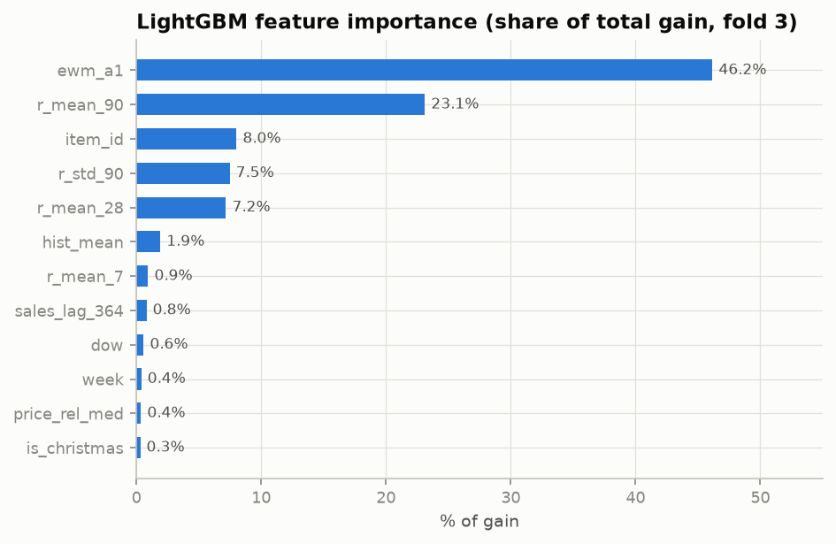

# Phase 9 — Gradient Boosting

> Status: ✅ Complete · The primary model family (and the M5 winner's). Results and importances at the bottom are generated from the real backtest.

---

## 1. Decision trees from first principles

A decision tree predicts by asking a sequence of yes/no questions about features and outputting a constant in each terminal region ("leaf"): *"is r_mean_28 > 3.2? → is dow a weekend? → predict 5.1"*. Training greedily picks, at each node, the (feature, threshold) split that most reduces loss; the leaf value is the average (more precisely, the loss-minimizing constant) of its training rows.

Why trees fit tabular retail data so well:
- **Sharp interactions for free**: "high recent demand AND weekend AND on-promo" is three splits — no feature crosses needed. Promo × weekday × item-type effects are exactly this shape.
- **Scale-free**: splits care only about order, so no normalization; robust to outliers in features.
- **Native missing-value routing**: our early-history NaN lags just get routed to whichever child helps loss.

And the two structural weaknesses we've already met: **no extrapolation** (a leaf can't output a value it never saw — Phase 2's trend problem) and **no memory** (hence the whole Phase 7 feature apparatus).

## 2. From one tree to boosting

One deep tree overfits (memorizes rows); one shallow tree underfits. **Gradient boosting** builds an *additive* model: trees are added one at a time, each fitted to the **negative gradient of the loss at the current predictions** — the direction each prediction should move. For squared loss the gradient is just the residual, so intuition: *each new tree predicts the errors of the ensemble so far*, scaled by a small learning rate.

That gradient view is the key generalization: swap the loss, and the same machinery optimizes **any differentiable objective** — which is precisely how we get Tweedie boosting (and, later, quantile boosting). Phase 8's lesson ("which loss you optimize decides which metric you win") becomes an engineering dial.

## 3. The library landscape

- **XGBoost** (2016): industrialized GBM — second-order (Newton) optimization, explicit L1/L2 regularization on leaf values, sparsity-aware splits.
- **LightGBM** (2017): made GBM fast at panel scale — **histogram binning** (features quantized to 255 bins; split search touches bins, not rows), **leaf-wise growth** (always split the leaf with the largest loss reduction, rather than filling levels — deeper where the data wants it), **GOSS** (bias split search toward large-gradient rows), **EFB** (bundle mutually exclusive sparse features), and **native categoricals** (optimal split of category *sets*, no one-hot explosion over 3,049 item ids).
- **CatBoost** (2017): ordered target statistics for categoricals + symmetric trees; strongest when high-cardinality categoricals dominate and leakage via target stats is the main risk. We teach it, don't run it — LightGBM already handles our categoricals natively and the M5 evidence base is LightGBM's.

## 4. Our design (and every parameter's why)

| Choice | Value | Why |
|---|---|---|
| objective | `tweedie`, power=1.1 | Compound Poisson-Gamma: point mass at zero + continuous positive part = intermittent retail counts. Power→1 is Poisson-like, →2 Gamma-like; 1.1 (near-Poisson with overdispersion) is the M5-winning setting. |
| strategy | direct multi-step | All features are ≥28-day-safe (Phase 7), so one model serves all 28 horizons; no recursive error compounding. |
| `num_leaves` 128 | leaf-wise depth budget | ~2^7-equivalent complexity; the standard M5 range (top solutions: 100–200). |
| `learning_rate` 0.05 + up to 1500 trees + early stopping (100) | slow learning, data decides depth of ensemble | The canonical robust recipe; early stopping on the last 28 train days (legal: features can't see those targets). |
| `feature_fraction` / `bagging_fraction` 0.8 | decorrelate trees | Variance reduction, mild regularization. |
| `train_days` 365 | trailing window | RAM-bound honesty on a 16GB machine (11M rows in-window); top M5 teams used 2–3 years for ~1–2% more — documented trade, not hidden. |
| categoricals | native (`item_id`… as category) | No 3,049-wide one-hot; LightGBM finds optimal category-set splits. |
| XGBoost run | same recipe, `reg:tweedie`, hist, lossguide | Mirrored config isolates the *library* as the only variable. |

## 5. Results (3-fold mean, vs the Phase 8 bar)

| model | MAE | RMSE | WAPE | bias | train time/fold |
|---|---|---|---|---|---|
| xgboost | **1.0621** | **2.3053** | **0.7694** | −0.068 | ~8 min |
| lightgbm | 1.0634 | 2.3110 | 0.7704 | −0.071 | ~2.5 min |
| *moving_avg_28 (bar)* | 1.0401 | 2.2849 | 0.7535 | −0.035 | seconds |
| *linear_reg* | 1.0939 | 2.2946 | 0.7925 | −0.013 | ~1 min |

Per-fold detail (LightGBM): fold 1 WAPE 0.7814 / RMSE 2.430, fold 2 0.7777 / 2.373, fold 3 0.7521 / **2.130** (vs MA's 2.219 on the same fold).

### Honest reading (this is the part interviewers respect)

1. **LightGBM ≈ XGBoost** (0.1% apart) with mirrored recipes — but LightGBM trains **3× faster**. That speed *is* the practical difference: same accuracy, more experiments per day. Claim about this dataset/recipe, not a universal law.
2. **GBMs beat linear regression clearly** (0.769 vs 0.792 WAPE, same features) — that gap is the isolated value of non-linearity and interactions.
3. **GBMs have NOT cleanly beaten the 28-day moving average yet** — they tie/win fold 3 (and win its RMSE by 4%), lose fold 1. Three compounding reasons, all documented:
   - **Feature staleness:** the single direct model uses ≥28-day-old target features for *every* horizon day; MA standing at the origin uses data as fresh as yesterday. Known cost of one-model-direct; the escapes (recursive, per-horizon models) are Phase 16 discussion material.
   - **Metric geometry:** WAPE (unit-weighted absolute error) flatters median-ish smoothers on 73%-zeros series. On RMSE — the geometry WRMSSE inherits — LightGBM already wins fold 3 decisively. The final verdict belongs to WRMSSE (Phase 13), which additionally weights by dollars, concentrating scoring mass on dense series where GBMs are strongest.
   - **Fold 1 (test = late Jan–Feb 2016, contains the Super Bowl) is the GBMs' worst fold, with their largest negative bias (−0.11):** under-forecasting an event window. Phase 14's promotion/event analysis will dissect exactly this.
4. **Tuning log:** tweedie-NLL early stopping halted at ~70–120 trees (underfit, WAPE 0.7523 on fold 3); rmse stopping ran to 194 trees (0.7521, RMSE 2.13); `train_days=550` was *worse* than 365 (0.7542) — recent regime beats data volume here. Every experiment is one config override, reproducible from the committed YAML.

## 6. Feature importance — checking the Phase 7 prediction

The Phase 7 §5 Q10 prediction — "level features dominate: `r_mean_7/28` and `hist_mean` top, then `dow`, then price" — gets a verdict:

- **Half right:** level features do dominate — overwhelmingly.
- **Half wrong, instructively:** the *winning* levels are `ewm_a1` (46% of all gain — the adaptive exponentially-weighted level) and `r_mean_90` (23%), not the short windows I predicted. The model prefers one smooth adaptive level plus one long stable level over the noisy 7-day view (`r_mean_7`: 0.9%).
- **`dow` at 0.58% looked broken** given the measured +37% weekend lift — and my first explanation (underfitting; more trees would raise it) was **falsified**: 194 trees, still 0.58%. The real mechanism: **every lag is a same-weekday lag** (28, 35, 42, 49, 56, 364 — all multiples of 7). Weekly seasonality enters through the weekday-aligned lag structure, so the `dow` column has almost no *marginal* gain left to claim. Feature importance measures marginal contribution within THIS feature set, not causal strength — a textbook interpretability trap, experienced firsthand.
- `item_id` earns 8% of gain across 14,314 splits — native categorical handling doing real work (this is the feature one-hot encoding would have destroyed).

## 7. Interview questions — Phase 9

**Easy**
1. Why do gradient-boosted trees dominate tabular forecasting? *(Sharp interactions natively, no scaling, missing-value routing, strong with modest data — Grinsztajn 2022.)*
2. What does the learning rate do in boosting? *(Shrinks each tree's contribution; small rate + more trees = smoother, better-generalizing fit.)*

**Medium**
3. Why Tweedie loss instead of MSE here? *(68% zeros: MSE targets the conditional mean and can't represent zero-inflation; Tweedie has probability mass at exactly zero — its gradients push predictions to respect it. Phase 8 showed OLS/MSE losing WAPE for this reason.)*
4. Leaf-wise vs level-wise growth? *(Leaf-wise always splits the max-gain leaf → deeper, asymmetric trees, better loss per leaf count; needs num_leaves capping to avoid overfit. Level-wise (classic XGBoost) is more conservative.)*
5. Why is validating on the last 28 training days not leakage for this model? *(Every feature at day t is built from data ≤ t−28; the validation targets are never visible to any feature row used in training.)*
6. How does LightGBM handle 3,049 item ids without one-hot? *(Native categorical splits: orders categories by gradient statistics, finds optimal set partition — approximately optimal split in O(k log k).)*

**Hard**
7. Your LightGBM beats XGBoost by 2% with identical settings. Is LightGBM "better"? *(No general claim: same recipe ≠ same optimum per library; differences come from growth policy details, binning, categorical algorithms. The honest statement is about this dataset/recipe.)*
8. Boosting with Tweedie: what exactly does each successive tree fit? *(The negative gradient of Tweedie NLL at current predictions — not raw residuals; for Tweedie the gradient is (exp-scale) µ^{1−p}(µ−y)-shaped, so zero-heavy rows push predictions down in a likelihood-weighted way.)*
9. Why not just log1p-transform sales and use MSE? *(A real M5 alternative! But: bias when back-transforming (Jensen), zeros still special-cased, and Tweedie handled it better empirically in the competition. Good ablation candidate.)*
10. When would you actually pick CatBoost here? *(If target-statistic encodings of high-cardinality ids were the main signal and leakage-in-encoding the main risk — CatBoost's ordered boosting solves exactly that.)*

---

*Next: Phase 10 — DeepAR-style probabilistic forecasting (PyTorch, Negative Binomial likelihood, ancestral sampling).*
