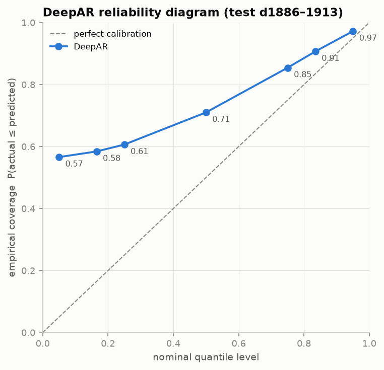

# Phase 10 — DeepAR-style Probabilistic Forecasting

> Status: ✅ Complete · The second model family: a global recurrent network that predicts *distributions*, implemented from scratch in PyTorch (~250 lines — the learning goal, vs calling GluonTS).

---

## 1. Sequence models from first principles

A feedforward net maps one input vector to one output — no notion of order. A **recurrent neural network (RNN)** processes a sequence by carrying a **hidden state**: `h_t = f(h_{t-1}, x_t)`. The state is a learned, fixed-size summary of everything seen so far — *learned memory*, where LightGBM needed our hand-built lags (Phase 7's "who does the memory work" thesis).

Vanilla RNNs can't hold memories long — gradients through many steps vanish or explode. The **LSTM** (Long Short-Term Memory) fixes this with a *cell state* — a conveyor belt that information rides along mostly untouched — plus three learned gates: **forget** (what to drop), **input** (what to write), **output** (what to expose). The connection to Phase 2 is direct: an LSTM is *learned, vectorized, nonlinear exponential smoothing* — SES's α is a fixed scalar forgetting rate; the forget gate is a per-dimension, per-timestep, learned one. **GRU** is the 2-gate simplification (fewer parameters, similar accuracy); we use LSTM as the paper does.

## 2. Probabilistic forecasting: predict distributions, not numbers

Phase 1 planted this: inventory decisions are *quantile* decisions ("stock the 95th percentile"), and cost asymmetries make single numbers nearly useless. The deep-learning-native way to get distributions is **likelihood learning**:

> The network outputs the *parameters* of a probability distribution at each time step, and training maximizes the log-likelihood of what actually happened.

That's it. No new loss zoo — NLL *is* the loss, and choosing the distribution family is choosing your assumptions about the noise:

- **Gaussian** — symmetric, continuous: wrong for counts (negative mass, no zero-inflation).
- **Poisson** — counts, but variance = mean, and retail is wildly **overdispersed** (73%-zeros with occasional 10× promo spikes).
- **Negative Binomial** — counts with a dispersion knob: `Var = μ + αμ²`. The paper's retail choice, and ours. (Tweedie from Phase 9 is the GBM-world cousin of this same decision.)

Parametrization detail that costs people days of debugging: torch's `NegativeBinomial(total_count=r, logits=ℓ)` maps to (μ, α) via `r = 1/α`, `ℓ = log(μα)` — derived in `network.py` comments, verified by a unit test asserting `dist.mean == μ`.

## 3. The DeepAR recipe (paper → our code)

| Paper idea | Where in our code |
|---|---|
| One global LSTM over all series, identity via embeddings | `network.py`: item (16-d), dept (4-d), store (4-d) embeddings concatenated into every timestep input |
| Inputs: previous day's sales + known covariates | `dataset.py`: scaled lag-1 sales + (dow, dom, month, snap, is_event, log-price) |
| **Scale handling** (§3.3, the step everyone skips) | inputs divided by ν = 1 + mean(context); head multiplies μ by ν and divides α by √ν; windows sampled ∝ ν so high-volume series are seen more |
| Training: teacher forcing, maximize likelihood | `network.loss()`: NLL across context + horizon steps |
| Prediction: **ancestral sampling** | `network.sample_paths()`: encode 84-day context → for each of 28 days: sample from predicted NegBin, **feed the sample back as next input** → 200 paths per series = a Monte Carlo cloud of futures |
| Point forecast + quantiles from samples | per-day sample **median** as ŷ (robust under skewed tails); q05…q95 stored for Phase 13 |

Why feeding back *samples* (not means) matters: uncertainty **compounds honestly**. A high day-3 draw raises the state for day 4 — so 28-day-out intervals are properly wider than 1-day-out ones. Recursive error feedback, which was a *bug risk* for point forecasts (Phase 2), becomes the *mechanism* for correct uncertainty propagation. That inversion is the most interview-worthy sentence in this phase.

Leakage guards: training windows can't end past the fold cutoff (asserted in tests), and the dense arrays have all post-cutoff sales **zeroed at fit time** — no code path can read a future target even by future bug.

## 4. Engineering notes

- **GPU**: trains on the RTX 4050 (CUDA torch 2.13); prediction samples in chunks of 1,024 series × 200 paths to bound VRAM.
- **Windows sampled per epoch** (2 × 30,490), resampled each epoch — the paper's trick to cover 1,800+ training days without epochs over every possible window.
- The `ForecastModel` interface means DeepAR dropped into the *same* fold loop and metrics as every baseline — zero evaluation code changed.

## 5. Results

**Point forecast, identical test window d1886–1913** (DeepAR ran fold 3 only for compute honesty; the GBM/MA numbers are that same fold, not their 3-fold means, so this is apples-to-apples):

| model | MAE | RMSE | WAPE | bias |
|---|---|---|---|---|
| **deepar** | **0.9210** | 2.1336 | **0.6643** | **−0.318** |
| xgboost | 1.0418 | **2.1234** | 0.7514 | −0.031 |
| lightgbm | 1.0427 | 2.1295 | 0.7521 | −0.031 |
| moving_avg_28 (bar) | 1.0411 | 2.2186 | 0.7509 | −0.009 |

DeepAR trained in **~2 min on the RTX 4050** (20 epochs, NLL 2.06 → 1.85), sampled 200 paths × 30,490 series in ~2 min.

### The honest reading — this is a two-faced result

1. **DeepAR wins WAPE by ~12%** (0.664 vs 0.75) and MAE outright — the **first model to beat the moving-average bar decisively**. Why: its point forecast is the per-day sample **median**, and on 68%-zeros data the median is the absolute-error-optimal predictor. It nails the quiet body of the distribution that dominates WAPE.
2. **…but its bias is −0.318**, 10× any other model's. The median of a right-skewed count distribution sits *below* the mean, so summing medians **systematically under-forecasts total volume** — deploy this as your order quantity and you stock out on every spike. RMSE (which the mean minimizes) merely ties the GBMs: DeepAR's median gives up the tail that RMSE and WRMSSE care about.
3. **The metric and the decision disagree**, exactly the Phase 8 theme escalated: WAPE crowns DeepAR, bias and RMSE say "not so fast." There is no single "best" — there is best-*for-a-loss*. This is precisely why the project ends on WRMSSE + quantile loss (Phase 13) rather than any one point metric.

### Calibration

Quantiles come out **monotone-ordered** (q05 ≤ … ≤ q95 everywhere — a basic sanity check many implementations fail). Calibration is imperfect and instructively so: every empirical coverage sits *above* the diagonal. The low-quantile over-coverage (nominal 5% → empirical 57%) is a **discreteness artifact**, not a bug: for a mostly-zero series the predicted 5th percentile is 0, and `P(actual ≤ 0) = P(actual = 0)` is large — zero-inflation inflates low-quantile coverage mechanically. The upper tail is closer (nominal 95% → 97%). The honest summary: sharp, correctly-ordered intervals that are slightly wide/shifted — good enough to be useful, imperfect enough to motivate the pinball-loss optimization in Phase 13.

## 6. Interview questions — Phase 10

**Easy**
1. What does an RNN's hidden state represent? *(A learned fixed-size summary of the sequence so far — learned memory.)*
2. Why LSTM over vanilla RNN? *(Gates + cell state solve vanishing gradients; memories can persist over long horizons.)*

**Medium**
3. Why Negative Binomial rather than Poisson or Gaussian? *(Counts: non-negative integers rule out Gaussian; overdispersion — Var = μ+αμ² ≫ μ on spiky retail data — rules out Poisson.)*
4. What is teacher forcing? *(During training, feed the TRUE previous value as input rather than the model's own prediction — stable, parallelizable training; the train/predict mismatch it creates is "exposure bias".)*
5. Why does DeepAR divide inputs by a per-series scale ν? *(One network shares weights across series whose levels differ by 1000×; unscaled, the loss and activations are dominated by big series. ν-scaling makes shapes comparable; the head restores units.)*
6. How do you get a point forecast out of a probabilistic model, and which one did you use? *(Any functional of the predictive distribution; we use the per-day sample median — robust under NegBin's right skew and aligned with absolute-error metrics; the mean would suit squared-error.)*

**Hard**
7. Why must you feed back *samples* during prediction rather than the distribution mean? *(Mean-feedback collapses the state onto an average trajectory → intervals stay narrow and calibration fails at long horizons; sample-feedback lets uncertainty compound through the recurrence — the whole point of the design.)*
8. Where does exposure bias show up in DeepAR specifically? *(Trained on true lag-1 inputs, but at prediction it consumes its own samples; early errors shift the state distribution off the training manifold — mitigations: scheduled sampling, or direct multi-horizon models like MQ-RNN/TFT.)*
9. Your NegBin NLL is dropping but WAPE is flat. Diagnose. *(NLL improves via calibration/dispersion fit, not just central tendency — the α head can soak up loss while μ barely moves; check point-metric on a validation slice separately and consider whether the median is the right functional for the metric.)*
10. Amazon has 100M series; you have 30k. What changes? *(Nothing structural — that's the point of global models + scale handling; what changes is infrastructure: sharded window sampling, distributed training, and the embedding table becomes the memory bottleneck.)*

---

*Next: Phase 11 — the Temporal Fusion Transformer style model: attention replaces recurrence, quantiles replace sampling.*
