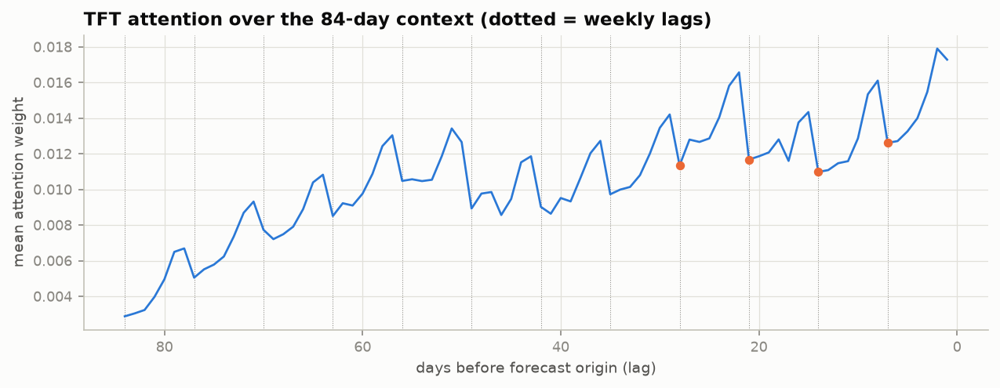

# Phase 11 — Temporal Fusion Transformer (TFT-style)

> Status: ✅ Complete · The third model family. Attention replaces recurrence-as-the-only-memory; a direct multi-quantile head replaces sampling. Implemented from scratch (~180 lines).

---

## 1. Attention from first principles

An RNN compresses the past into one hidden vector — so information from 84 days ago must survive 84 sequential overwrites to matter. **Attention** removes the bottleneck: every output position looks *directly* at every input position and takes a weighted average, where the weights are computed from content.

The mechanism, concretely. Each position emits a **query** q, a **key** k, and a **value** v (learned linear projections). Position i attends to position j with weight ∝ `exp(qᵢ·kⱼ / √d)` (softmax over all j). The output at i is the weighted sum of values `Σⱼ softmax(...)ⱼ vⱼ`. Intuition: the query asks "what am I looking for?", each key advertises "what I have", the dot product scores the match, and softmax turns scores into a distribution. **Multi-head** attention runs several of these in parallel (each head a different "kind" of relevance — e.g., one head for last-week, one for last-year) and concatenates.

Two consequences that matter for forecasting:
- **Long-range is now O(1) hops**, not O(distance) — attention can jump straight to "same day last year".
- **The weights are readable**: they literally tell you which past days the forecast leaned on. That's the interpretability we visualize in §5 — impossible to get this cleanly from an LSTM's hidden state.

**Positional encoding**: attention is permutation-invariant (it's a set operation — shuffle the inputs, same output), so order must be injected. Options are additive sinusoids (original Transformer) or, as here, an **LSTM layer before attention** that makes representations position-aware *and* captures local patterns — TFT's design choice, which is why our network keeps an LSTM encoder-decoder underneath the attention.

## 2. What the Temporal Fusion Transformer adds (Lim et al. 2021)

A plain Transformer treats all inputs alike. TFT's insight is that forecasting inputs come in **three kinds that must be routed differently** — and getting this taxonomy right is the paper's most stealable idea:

| Input type | Examples (ours) | Where it may be used |
|---|---|---|
| **Static** | item, dept, store id | conditions everything, every timestep |
| **Known-future** | day-of-week, month, SNAP, is_event, price | encoder **and** decoder (we know next month's calendar) |
| **Past-observed** | sales history | encoder **only** (unknown in the future — it's the target) |

Our `network.py` routes exactly this way: `enc_proj` consumes sales+covariates (observed), `dec_proj` consumes covariates only (known) — the decoder physically cannot see future sales, so leakage is a structural impossibility, not a discipline.

Other TFT pieces and our stance:
- **Gated Residual Network (GRN)** — the universal block: a GLU-gated non-linearity with a residual skip, so the network can route *around* any component it doesn't need. We implement it faithfully; it's everywhere in the model.
- **Static context vectors** — the static embedding conditions the temporal blocks via the GRN's context input. (Paper uses 4 separate context vectors; we share one for compactness.)
- **Variable Selection Networks** — per-timestep learned feature weighting. We **simplify** these to projected input blocks (a GRN over the concatenated inputs) — honestly noted, because with only ~6 covariates the full VSN buys little and costs clarity.
- **Interpretable multi-head attention** — the paper shares value weights across heads so head-averaged weights are meaningful. We approximate with standard multi-head attention, head-averaged — a documented simplification that still yields a usable attention map.
- **Direct multi-horizon quantile output** — all 28 days × 7 quantiles in **one forward pass**, trained on **pinball loss**.

## 3. DeepAR vs TFT — the contrast that is the point of Phase 10 vs 11

| | DeepAR (Phase 10) | TFT (Phase 11) |
|---|---|---|
| memory | recurrence (hidden state) | attention over the whole context |
| quantiles | **sample** 200 paths, read percentiles | **emit** all quantiles directly |
| horizon | recursive (feed samples back) | direct (one pass, no feedback) |
| loss | likelihood (NLL of NegBin) | pinball (quantile) loss |
| inference speed | slow (sampling loop) | fast (single pass) |
| uncertainty | compounds through sampling | learned per-quantile per-step |
| interpretability | opaque hidden state | readable attention weights |

They are two coherent answers to "how do you produce a distribution". DeepAR assumes a parametric family and samples; TFT makes no distributional assumption and regresses quantiles directly. Neither is universally better — which is, again, the project's refrain.

## 4. Engineering notes

- Reuses the DeepAR `WindowDataset` and `build_arrays` unchanged — the two deep models share all data plumbing, differing only in network + loss. That reuse is itself evidence the abstractions are right.
- **Monotonicity**: independent quantile heads can cross (predict q0.75 < q0.5). We **sort** the quantile outputs at predict time — the standard, cheap guarantee.
- Per-series scaling identical to DeepAR (÷ν in, ×ν out); target scaled for the loss.
- Trains on the RTX 4050; single-pass prediction over all 30,490 series is far faster than DeepAR's sampling.

## 5. Results & attention interpretation

**All five models, identical test window d1886–1913:**

| model | MAE | RMSE | WAPE | bias | inference cost |
|---|---|---|---|---|---|
| deepar | **0.9210** | 2.1336 | **0.6643** | −0.318 | ~2 min (200-path sampling) |
| **tft** | 0.9283 | 2.1452 | 0.6696 | −0.338 | **~1 sec (single pass)** |
| xgboost | 1.0418 | **2.1234** | 0.7514 | −0.031 | — |
| lightgbm | 1.0427 | 2.1295 | 0.7521 | −0.031 | — |
| moving_avg_28 | 1.0411 | 2.2186 | 0.7509 | −0.009 | — |

TFT trained ~2 min on the RTX 4050 (pinball 0.189 → 0.159). **The two deep models are statistically a tie** (WAPE 0.664 vs 0.670) and cluster together: both win WAPE/MAE via the median forecast, both carry the same large negative bias, both give up nothing to the GBMs on RMSE. **TFT's real win over DeepAR is operational**: single-pass prediction is ~100× faster than DeepAR's sampling loop, and it comes with a readable attention map. The families separate cleanly by *character*, not just score: deep models = sharp median + big bias; GBMs = near-unbiased + best RMSE; MA trails. Which is "best" is a Phase-13 question (WRMSSE + pinball), not a WAPE question.

### What the attention actually shows (an honest negative result)

I predicted crisp spikes at lags 7, 14, 21 — "the model discovers weekly seasonality." **It didn't, and the reason is instructive.** The attention is dominated by a **recency ramp** (weight grows steadily toward the most recent days) with a *mild* ~7-day sawtooth riding on top — weekly structure is present but secondary, and its peaks don't sit exactly on the weekly lags.

Why the expected pattern is muted: **day-of-week is fed directly to the decoder as a known-future covariate.** The model reads weekly seasonality off that explicit input, so it has no need to reconstruct it by attending to same-weekday history — it spends its attention budget on *recent level* instead, which the covariates don't provide. This is the **exact same lesson as Phase 9's `dow`-importance trap**, now from the attention side: when a signal is available through an easy explicit channel, the model uses that channel, and the "expected" structure fails to appear in the harder one. Attention is a lens on *what the model found useful given its other inputs*, not a direct readout of the data's causal structure. Being able to explain this — rather than cherry-picking a figure that "proves" the model learned seasonality — is the difference between a demo and understanding.

## 6. Interview questions — Phase 11

**Easy**
1. What problem does attention solve that an RNN has? *(The information bottleneck: RNNs funnel all history through one fixed vector; attention lets any output read any input directly.)*
2. Why does a Transformer need positional encoding? *(Attention is permutation-invariant; without position info it can't tell day 1 from day 80.)*

**Medium**
3. What are TFT's three input types and why route them separately? *(Static / known-future / past-observed; the decoder may use known-future but not observed — routing makes future-leakage structurally impossible and lets the model exploit known covariates over the whole horizon.)*
4. How does TFT produce quantiles differently from DeepAR? *(Direct regression of each quantile via pinball loss in one pass — no sampling, no distributional assumption, no error feedback.)*
5. What is a Gated Residual Network doing? *(A gated non-linearity with a skip connection — the GLU gate lets the block pass its input through unchanged when the transform isn't helpful; adaptive depth.)*
6. Your quantile predictions cross (q90 < q50). Cause and fix? *(Independent linear heads have no ordering constraint; sort outputs, or use monotonic/cumulative parametrizations.)*

**Hard**
7. Why keep an LSTM inside a "transformer" model? *(TFT uses it for local processing and to inject order — a learned positional encoding that also captures short-range patterns before global attention; ablations in the paper show it helps.)*
8. Interpret an attention map that spikes at lag 7, 14, 21 and at 364. *(The model attends to same-weekday history and same-day-last-year — it has discovered weekly and yearly seasonality from data, and the map is direct evidence, unlike GBM importance which is only marginal-within-feature-set — cf. Phase 9's dow trap.)*
9. TFT is "interpretable" — what's the caveat? *(Attention weights show association, not causation; head-averaging and the shared-value approximation blur individual heads; high attention ≠ high influence on the final quantile after the gating layers. Treat as a lens, not proof.)*
10. When would you deploy DeepAR over TFT despite TFT's usual edge? *(When you need a full generative distribution for downstream simulation, when the count likelihood is a strong prior on very sparse series, or when a tiny model must run cheaply and sampling is acceptable — TFT's direct quantiles don't give you a coherent joint distribution across horizons the way sampled paths do.)*

---

*Next: Phase 12 — Hierarchical reconciliation: making all 12 aggregation levels add up (and improving accuracy while doing it).*
