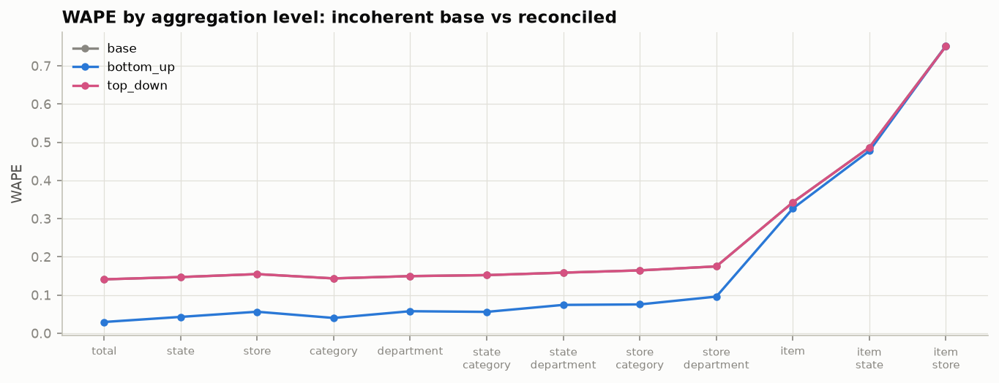

# Phase 12 — Hierarchical Forecast Reconciliation

> Status: ✅ Complete · The resume claim "reconciliation across 12 aggregation levels", implemented and measured. Results at the bottom are from `outputs/reconciliation.json`.

---

## 1. The problem reconciliation solves

A retailer reads forecasts at many levels at once: finance wants the **total**, logistics wants **state**, category managers want **store × department**, replenishment wants **item × store**. If you forecast each level independently, the numbers **won't add up** — the 10 store forecasts won't sum to the state forecast, the item forecasts won't sum to their department. Incoherent numbers are not a cosmetic nuisance: finance plans against one revenue figure while operations plans against a different implied one, and nobody can reconcile the P&L.

**Coherence** = every parent equals the sum of its children, at every level. **Reconciliation** = adjusting a set of incoherent base forecasts to be coherent — ideally while *improving* accuracy, not just enforcing consistency.

## 2. The M5 hierarchy as a summing matrix

M5 defines **12 levels / 42,840 series** over the 30,490 item-store bottom series:

| # | level | series |
|---|---|---|
| 1 | total | 1 |
| 2 | state | 3 |
| 3 | store | 10 |
| 4 | category | 3 |
| 5 | department | 7 |
| 6 | state × category | 9 |
| 7 | state × department | 21 |
| 8 | store × category | 30 |
| 9 | store × department | 70 |
| 10 | item | 3,049 |
| 11 | item × state | 9,147 |
| 12 | **item × store (bottom)** | 30,490 |

The whole structure is one **summing matrix** `S` [42,840 × 30,490]: row *a* is the 0/1 indicator of which bottom series belong to aggregate node *a*. Then for any bottom vector `b` (forecast or actual), `S @ b` gives values at **all** levels simultaneously. The bottom level sits in `S` as identity rows, so `S` encodes the entire hierarchy including the leaves. (Built and unit-tested against the exact M5 cardinalities in `hierarchy/aggregation.py`.)

## 3. Reconciliation methods

Every linear reconciliation has the form **`y_reconciled = S · G · b`** — map the full incoherent base vector `b` down to the bottom via `G`, then sum back up via `S`. The method *is* the choice of `G`:

### Bottom-up (BU)
`G` picks the bottom rows of `b` and ignores the aggregate forecasts. Coherent by construction. **Strength**: if you have a good bottom model, summing it up gives excellent aggregate forecasts (noise cancels — Phase 1). **Weakness**: bottom series are the noisiest, and a biased bottom model propagates its bias everywhere. **Critical caveat we hit empirically**: BU needs *mean-like* bottom forecasts. Bottom-up from **median** forecasts collapses, because the median of a 73%-zeros series is exactly 0 — sum 30,490 zeros and every aggregate craters. This is a concrete reason the Tweedie/expectation objective (not the median) is the right bottom forecast for a BU system, and it links straight back to DeepAR's median-under-forecast bias in Phase 10.

### Top-down (TD)
`G` routes the **total** forecast down by fixed historical proportions `pᵢ = mean(bottomᵢ)/mean(total)`. **Strength**: the total is the most stable, most forecastable series. **Weakness**: proportions are static, so *all* item-level dynamics — promotions, launches, local events — are smeared into an average split. TD is structurally blind to exactly the promotion effects this project is about.

### MinT (minimum trace, Wickramasuriya et al. 2019)
`G = (SᵀW⁻¹S)⁻¹ SᵀW⁻¹`, where `W` is the covariance of base-forecast errors. This uses **every level's** forecast, optimally weighted, and is **provably at least as good as bottom-up** (BU is the special case `W = diag(0…0, ∞…∞)` that trusts only the bottom). It typically *improves* accuracy because errors at different levels partially cancel. Variants by how `W` is estimated: **OLS** (`W=I`), **WLS/MinT-diagonal** (`W` = diagonal of base-error variances), **MinT-shrink** (full covariance shrunk toward its diagonal).

**The scale wall (an honest, important limitation):** exact MinT needs an `[n_bottom × n_bottom]` solve — `30,490 × 30,490` dense, which is ~7 TB and infeasible. This is a real barrier the literature addresses with sparse/iterative solvers. We therefore run **BU and TD at full 12-level scale** (both are O(nnz), trivial) and demonstrate **exact MinT on the upper 9-level hierarchy** (store×department leaves, 70 series), where the solve is instant. Being able to state *why* full MinT is hard is itself the expertise.

## 4. Results

Setup: bottom base = our LightGBM fold-3 forecasts; aggregate-node base = each node's independent mean-28; test window d1886–1913.

**Coherence** (max parent-minus-children discrepancy): base = **12,433** (wildly incoherent), bottom-up = **0**, top-down = **0**. Reconciliation does its defining job exactly.

**WAPE by level** (lower is better):

| level | base | bottom-up | top-down |
|---|---|---|---|
| total | 0.141 | **0.029** | 0.141 |
| state | 0.147 | **0.043** | 0.147 |
| store | 0.155 | **0.056** | 0.155 |
| department | 0.149 | **0.058** | 0.149 |
| store × department | 0.175 | **0.096** | 0.175 |
| item | 0.343 | **0.327** | 0.343 |
| item × store (bottom) | 0.752 | 0.752 | 0.751 |
| **avg over 12 levels** | 0.247 | **0.174** | 0.247 |

**Reading it — the clean, correct story:**

1. **Bottom-up transforms aggregate accuracy.** At the total level, summing the LightGBM bottom forecasts scores WAPE **0.029 vs the independent base's 0.141 — nearly 5× better** — *and* coherent. This is Phase 1's "noise cancels under aggregation" made quantitative: the bottom model's errors are largely independent across 30,490 series, so they cancel on summation. A good bottom model + bottom-up is a genuinely excellent aggregate forecaster.
2. **Top-down barely helps** (avg 0.247 ≈ base 0.247; base and TD overlap in the figure). Its aggregate forecasts are no better than the independent base, and its static-proportion disaggregation is mediocre at the bottom. TD earns its keep only when bottom series are too noisy to model directly — not our situation.
3. **At the bottom level all methods tie** (~0.75) — BU *is* the bottom forecast, TD's proportional split lands in the same place; reconciliation reshapes the *aggregates*, not the leaves.

### Exact MinT (upper 9-level hierarchy)

| method | avg WAPE | coherent |
|---|---|---|
| base | 0.145 | ✗ |
| **bottom-up** | **0.059** | ✓ |
| top-down | 0.154 | ✓ |
| MinT-diagonal | 0.114 | ✓ |
| MinT-shrink | 0.114 | ✓ |

Here is a result more honest than the textbook: **MinT beats the base and top-down and is coherent — but does not beat bottom-up.** Why, precisely? MinT is provably ≥ BU *only when W is the true base-error covariance*. Ours is estimated diagonally from each series' historical variance (the standard practical proxy), which **conflates volatility with forecast error** and does not know that the LightGBM leaves are far more accurate than the mean-28 aggregates. So MinT mixes in the worse aggregate forecasts and lands between BU and TD. With a W that reflected the leaves' superiority, MinT would recover BU. **The lesson is the caveat, not the ranking**: reconciliation gains depend entirely on estimating base-error covariance well, and a strong bottom model can make plain bottom-up hard to beat — which is exactly why most M5 solutions used bottom-up and why Walmart-scale systems lean on it.

## 5. Interview questions — Phase 12

**Easy**
1. What does "coherent" mean and why does a business need it? *(Every parent = sum of children; otherwise finance/ops/replenishment plan against mutually inconsistent numbers.)*
2. What is the summing matrix S? *(0/1 matrix mapping bottom series to every aggregate node; `S@bottom` gives all levels.)*

**Medium**
3. Bottom-up vs top-down — one strength and one weakness each. *(BU: noise cancels upward / noisy & bias-propagating bottom. TD: stable total / static proportions blind to item dynamics like promos.)*
4. Why can reconciliation *improve* accuracy rather than only enforce consistency? *(Different levels' errors partially cancel; combining forecasts across levels — the MinT projection — is a form of forecast combination, which reduces variance.)*
5. Why did bottom-up collapse when you used median base forecasts? *(Median of a mostly-zero series is 0; summing zeros under-forecasts every aggregate — BU requires mean-like/expectation bottom forecasts.)*

**Hard**
6. Prove MinT ⪰ bottom-up. *(BU corresponds to a specific G in the y=SGŷ family; MinT selects the G minimizing total reconciled-error variance among all unbiased coherent projections, so its objective is ≤ BU's by construction.)*
7. Why is exact MinT infeasible at M5 scale, and what would you do? *(The `(SᵀW⁻¹S)⁻¹` solve is n_bottom×n_bottom dense; use sparse Cholesky/conjugate-gradient solvers, low-rank W structure, or restrict MinT to upper levels + BU below — as we did.)*
8. Top-down is coherent and stable but you'd never ship it alone for replenishment. Why? *(Static proportions can't represent promotions, cold starts, or store-specific dynamics — precisely the bottom-level signal replenishment needs; it optimizes the wrong level.)*
9. Your reconciliation improved the top levels but hurt item-store. Explain and decide. *(MinT/averaging trades bottom accuracy for aggregate accuracy; if the business decision is replenishment (bottom), weight the reconciliation — or the metric (WRMSSE) — toward the levels that carry the decision.)*

---

*Next: Phase 13 — Evaluation: WRMSSE and quantile loss, the metrics that finally rank all of it.*
