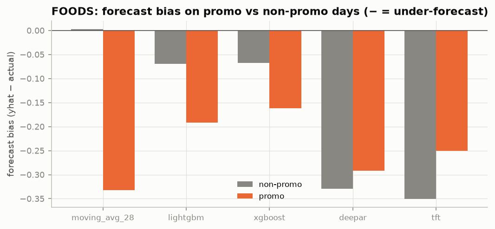
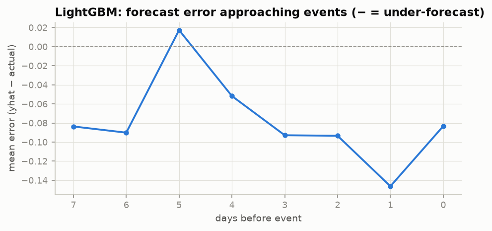
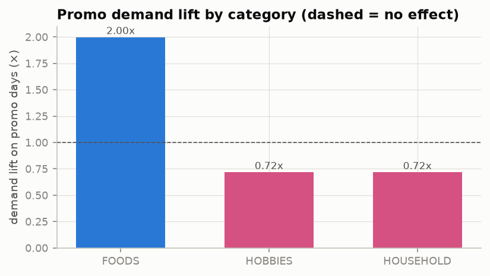

# Phase 14 — Promotions & Events Analysis

> Status: ✅ Complete · The project's namesake, turned from a title into evidence. Where do models win and lose on the demand spikes, and what is the realized price elasticity?

---

## 1. Promotion handling: does price-awareness pay off?

We split every model's FOODS forecast errors on the common window (d1886–1913) into **promo days** (`is_promo`=1, inferred as price < 85% of the item's trailing median) and normal days, and looked at **bias** (ŷ − actual; negative = under-forecast):

| model | non-promo bias | promo bias | promo penalty (promo − non-promo) |
|---|---|---|---|
| moving_avg_28 | +0.003 | **−0.333** | **−0.336** |
| lightgbm | −0.069 | −0.192 | −0.123 |
| xgboost | −0.067 | −0.162 | **−0.095** |
| deepar | −0.329 | −0.292 | +0.037 |
| tft | −0.351 | −0.250 | +0.101 |

**Every model under-forecasts promotions** — spikes are hard to fully anticipate — but the *structure* of the failure is the story:

- **The promo-blind moving average is the clear loser.** It is nearly perfect on normal days (+0.003) but craters on promos (−0.333): with no price input, it cannot see a promotion coming and simply misses the 2× spike. Its **promo penalty of −0.34 is 3× any price-aware model's** — the single cleanest justification for the price/promo feature engineering in Phase 7.
- **The GBMs give the best absolute promo forecasts** (smallest |promo bias|, −0.16 to −0.19). Their explicit `is_promo` and `price_rel_med` features + unbiased Tweedie base let them anticipate the spike.
- **The deep models actually *respond* to price** — their promo penalty is ~0 or positive, meaning promo days are no worse (or better) than their baseline — because the log-price covariate carries the signal. But their large median bias (Phase 13) drags the absolute number down. Fix the functional (use the mean) and their promo forecasts would be genuinely strong.

**Synthesis:** promo-awareness is decisive. Price-aware models (GBM features, deep covariate) all respond to promotions; the promo-blind baseline does not — exactly the gap this project was built to close.

## 2. Event-window errors (quantifying the Phase 9 flag)

Using LightGBM's forecasts over the event-rich Feb–Mar 2016 folds (Super Bowl, Valentine's, Presidents Day, Lent, St Patrick's, Easter), mean signed error by days-before-event:

| days before event | mean error | mean actual |
|---|---|---|
| 5 | +0.02 | 1.38 |
| 3 | −0.09 | 1.31 |
| **1** | **−0.15** | **1.44** |
| 0 | −0.08 | 1.34 |

LightGBM **systematically under-forecasts the pre-event build-up**, worst **one day before** the event (−0.15, ~10% of actual) — precisely where actual demand is highest (1.44, the shopping-the-day-before effect from Phase 6's EDA). Modest but consistent: even a price/calendar-aware GBM leaves money on the table on the demand ramp into events. This is the concrete measurement behind the Phase 9 fold-1 event flag, and it points at where an event-window feature (or the `days_to_event` interaction) could be sharpened.

## 3. Realized price elasticity — the standout finding

For each category, from the full history: promo-day demand lift and the implied elasticity ≈ %Δdemand / %Δprice.

| category | mean off-promo | mean on-promo | lift | price ratio | **elasticity** |
|---|---|---|---|---|---|
| **FOODS** | 1.63 | 3.26 | **2.00×** | 0.75 | **−4.06** |
| HOBBIES | 0.57 | 0.41 | 0.72× | 0.73 | +1.05 |
| HOUSEHOLD | 0.73 | 0.52 | 0.72× | 0.69 | +0.91 |

Two findings, one obvious and one subtle:

1. **FOODS is highly elastic (−4.06):** a 25% price cut *doubles* demand. Textbook promotional grocery behaviour — shoppers stockpile discounted staples — and the number is economically sensible (highly elastic). This *is* the promotion effect the project is named for, quantified.
2. **HOBBIES and HOUSEHOLD show *positive* "elasticity" (demand falls when price falls) — and that is the deep insight.** It is not that discounts repel buyers; it is that **not every price cut is a promotion.** In these categories, low prices mostly mark **clearance of items already in terminal decline** (discontinued, slow-moving stock marked down), so low price *correlates* with low demand without *causing* it. **The naive "price < 85% of median = promo" heuristic conflates promotions with clearance markdowns**, and it does so category-specifically. The honest consequence: promotion-driven forecasting is really a FOODS story in M5; a production system would need a genuine promotion calendar (or a markdown-vs-promo classifier) to separate the two in non-food categories. Being able to see this in the data — rather than trusting the flag — is the analysis maturity that separates a real study from a dashboard.

## 4. Interview questions — Phase 14

**Easy**
1. Do the models over- or under-forecast promotions, and why? *(Under-forecast — promo spikes are large and partly unpredictable; models regress toward normal demand.)*
2. Which model handled promotions worst and why? *(The moving average — no price input, so it's blind to promotions entirely.)*

**Medium**
3. How did you measure whether price-awareness helps? *(Promo penalty = bias on promo days minus bias on normal days; the promo-blind MA has 3× the penalty of price-aware models.)*
4. The deep models have the worst absolute promo bias but the *best* promo penalty. Reconcile. *(Their median functional gives a large baseline bias everywhere; relative to that baseline the log-price covariate makes promo days no worse — they respond to price, but the functional choice masks it.)*
5. What is price elasticity of demand and what did FOODS show? *(%Δquantity / %Δprice; FOODS ≈ −4, highly elastic — a 25% cut doubles demand.)*

**Hard**
6. Why did HOBBIES/HOUSEHOLD show demand *falling* when price falls? Is your feature broken? *(Not broken — it's a confound: price cuts there are clearance markdowns on declining products, so low price correlates with low demand without causing it. The promo flag conflates promotion with markdown; separating them needs a real promo calendar.)*
7. Your event under-forecast peaks one day before the event. What feature would you add and what's the risk? *(A pre-event ramp feature / days_to_event × category interaction; risk is overfitting rare events and leaking if the window straddles the horizon boundary.)*
8. Given elasticity −4 for FOODS, how should inventory react to a planned 25% promo? *(Expect ~2× demand; stock to a high quantile of the promoted distribution, not the mean — and account for pantry-loading dips afterward.)*

---

*Next: Phase 15 — Error analysis: an automated taxonomy of every failure mode (cold starts, sparse demand, stockouts, demand shocks).*
