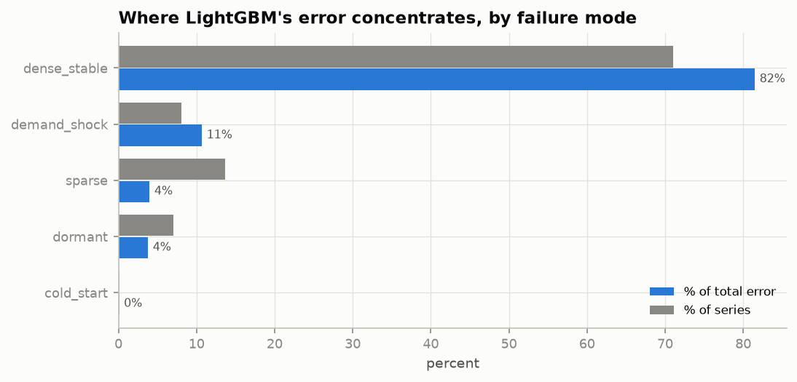

# Phase 15 — Automated Error Analysis

> Status: ✅ Complete · A failure taxonomy over all 30,490 series: not "how big is the error" but "*where* does it live and *why*". Two models with equal WRMSSE can fail on totally different series — this phase says which.

---

## 1. The idea

A single metric hides the shape of failure. Phase 15 classifies every series by a **failure regime** — read off its *training* history so the label is knowable before the forecast — then measures how much of the champion (LightGBM) error each regime carries. The regimes, assigned by priority:

| regime | rule | what it is |
|---|---|---|
| cold_start | < 90 days of history | too little pattern to learn |
| dormant | sold before, but last 28 training days all zero | delisting or **stockout** (censored demand, Phase 1) |
| sparse | ≥ 85% zero days | intermittent long tail |
| demand_shock | test level ≠ recent training level (>2× or <½×) | regime change / shock |
| dense_stable | everything else | the "easy", high-volume series |

## 2. Where the error lives

| regime | series % | **error share %** | sales share % | WAPE | mean actual |
|---|---|---|---|---|---|
| dense_stable | 71.0 | **81.5** | 90.3 | **0.678** | 1.76 |
| demand_shock | 8.1 | 10.7 | 6.3 | 1.276 | 1.08 |
| sparse | 13.7 | 4.0 | 2.1 | 1.430 | 0.21 |
| dormant | 7.0 | 3.8 | 1.2 | 2.385 | 0.23 |
| cold_start | 0.1 | 0.1 | 0.1 | 0.885 | 0.92 |

Four conclusions, each with an action:

1. **Most error mass is unavoidable and well-forecast.** Dense/stable series are 71% of series, 90% of *sales*, and 81% of *error* — but their WAPE (0.68) is the **best** of any regime. The error is large only because the demand is; per-unit these are forecast well. *Action: nothing — this is error following volume, not a fixable weakness.*
2. **Demand shocks are the real failure.** 8% of series but **11% of error** (error share > sales share) at WAPE 1.28 — nearly 2× the dense rate. These are regime changes the model can't see coming from history alone. *Action: this is the highest-leverage target — external signals (promotions, events, weather) or faster-adapting features.*
3. **Sparse and dormant are relatively terrible but low-impact.** WAPE 1.43 and **2.39** (both *worse than naive*) — yet only 4% of error each, because they barely sell (mean actual ~0.2). The dormant category is the most diagnostic: these went quiet in training and then sold in the test window. Many are **stockout recoveries** — the training zeros were *censored demand* (Phase 1), not true zeros, so a model trained on them under-forecasts the return. *Action: don't chase their WAPE (it barely moves WRMSSE); do treat their training zeros as censored, not real.*
4. **Cold-start is negligible *here* — a caveat, not a triumph.** Only 24 series (0.1%), because M5 is a fixed 5-year catalog. A live retailer introduces products constantly, so cold-start would dominate; our low number reflects the dataset, not a solved problem. *Action: state the limitation honestly; a production system needs an attribute-based cold-start model.*

## 3. The worst individual series

The 10 largest absolute errors are almost all **high-volume FOODS_3 items, heavily concentrated in store WI_2** — e.g. `FOODS_2_360_WI_2` forecast 993 vs actual 1862 (under by half). These are exactly what revenue-weighted WRMSSE punishes most: big misses on big sellers. The WI_2 concentration is a lead worth pulling — a store-specific volatility or data issue — and a reminder that aggregate metrics can hide a single store driving the tail. A few of the worst are `dormant` (e.g. `FOODS_3_007_WI_2`: forecast 375, actual 880 — a dormant series that roared back, the censored-demand failure in the flesh).

## 4. Takeaways for the modelling

- The productive fix is **not** better sparse-series handling (low impact) but **demand-shock robustness** and **high-volume accuracy** — precisely what WRMSSE rewards and WAPE obscures.
- Stockout-censored zeros are a data-quality problem masquerading as a modelling problem; the dormant regime isolates them.
- Error diagnosis, not a scalar, is what tells you where to spend effort — this taxonomy would look completely different for the median-forecasting deep models (their error would concentrate in the high-volume dense series via bias), which is why per-regime analysis belongs in any serious evaluation.

## 5. Interview questions — Phase 15

**Easy**
1. Why analyze error by regime instead of one number? *(A scalar hides where failure lives; two models with equal WRMSSE can fail on different series and need different fixes.)*
2. Which regime carries the most error mass and is that bad? *(Dense/stable — but it's the best WAPE; the mass just follows volume, not a weakness.)*

**Medium**
3. Sparse series have WAPE 1.4 but you deprioritize them. Why? *(They barely sell — 4% of error, negligible WRMSSE weight; effort there doesn't move the business metric.)*
4. What is the "dormant" regime and why does it tie to Phase 1? *(Series that went quiet in training then sold in test — often stockout recoveries where the training zeros were censored demand, so the model under-forecasts the return.)*
5. Your cold-start error is tiny. Should you be pleased? *(No — it reflects M5's fixed catalog; a real retailer's constant new products would make cold-start dominant. It's a dataset artifact, not a solved problem.)*

**Hard**
6. Demand-shock error share (11%) exceeds its sales share (6%). What does that ratio tell you and what do you do? *(The regime is disproportionately hard — the model's biggest genuine weakness; target it with external/covariate signals or faster-adapting features rather than more history.)*
7. The worst errors cluster in one store. How do you investigate without overfitting to it? *(Check for data issues/regime shifts in WI_2; add store-level diagnostics; but validate any store-specific fix on other folds to avoid chasing one window's noise.)*
8. How would this taxonomy differ for the DeepAR median forecasts? *(Its systematic under-forecast bias would pile error into the high-volume dense regime; the sparse/dormant picture would look better in relative terms — showing that "where error lives" is model- and functional-specific.)*

---

*Next: Phase 16 — Research analysis: answering "when does each model family win?" with experiment-backed conclusions.*
